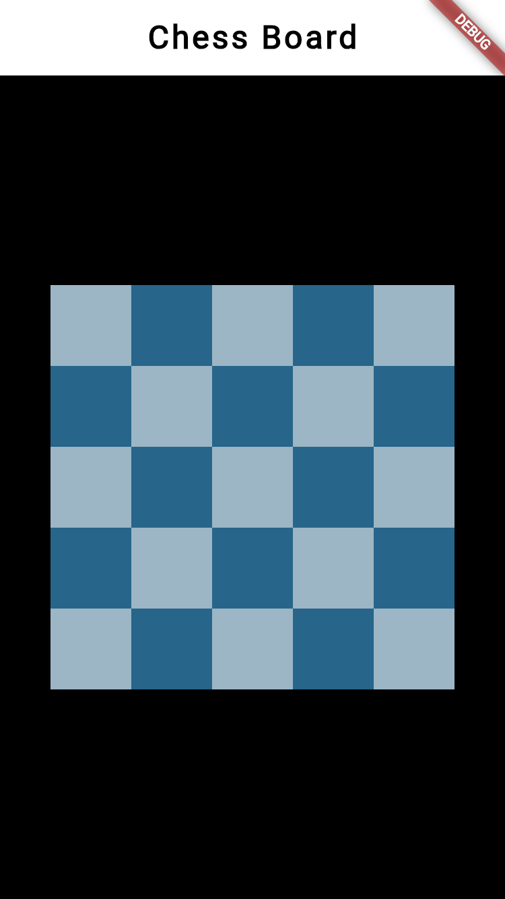

# ♟️ Flutter Chess Board UI

A visually precise and responsive chess board design implemented using **Flutter**. This project was developed as a UI challenge to master complex grid layouts and component styling.

## 🚀 Project Overview
This repository focuses on the architectural design of a chess board, ensuring a pixel-perfect layout across different screen sizes. It serves as a foundational component for a full-scale chess application.

## ✨ Key Features
- **Responsive Grid:** Automatically adjusts to different screen dimensions (Web & Mobile).
- **Custom Styling:** Clean, alternating tile patterns using Flutter containers.
- **Flutter Web Support:** Optimized for browser rendering and desktop views.
- **Clean Component Logic:** Organized widget structure for easy piece placement and future logic integration.

## 🛠️ Technical Concepts Used
- **GridView.builder:** Efficiently rendering the 64-square grid.
- **Aspect Ratio Management:** Ensuring the board remains perfectly square on all devices.
- **Stateless Architecture:** Lightweight and performant UI components.

## 📁 Project Structure
- `lib/`: Contains the core board layout and tile logic.
- `web/`: Configuration for Flutter Web deployment.
- `test/`: Placeholder for UI-specific unit tests.

## 🚀 How to Run
1. **Clone the repo:**
   
   ```bash
   git clone https://github.com/SHADOWRULIN/ChessBoard-Design-Flutter.git
   
2. **Navigate to the folder:**
   
   ```bash
   cd ChessBoard-Design-Flutter
   
3. **Run for Web:**
   
   ```bash
   flutter run -d chrome

## 👤 Author
   **Muhammad Fahaz Khan**  
   - **GitHub:** [@SHADOWRULIN](https://github.com/SHADOWRULIN)  
   - **LinkedIn:** [Fahaz Khan](https://www.linkedin.com/in/muhammad-fahaz-khan-85b805293/)

## 📄 License
This project is licensed under the **MIT License** — see the LICENSE file for details.
